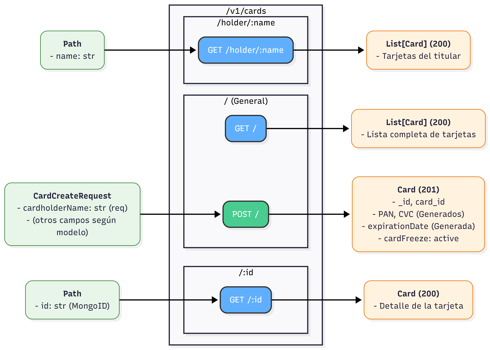
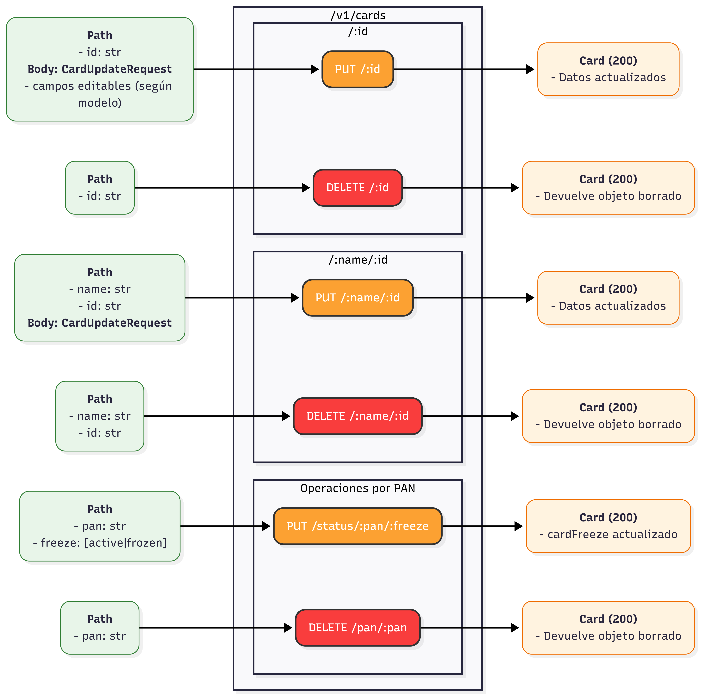

# Documentacion 

| **Autores**                | **Microservicios Implementados**                                              |
|:---------------------------|:------------------------------------------------------------------------------|
| **Álvaro Vigara Suárez**   | API Gateway, Microservicio Accounts (Python), Microservicio Currencies (Java) |
| **Pablo Medinilla Mejías** | Microservicio cards, Frontend Común completo
---

## 1. Nivel de Acabado

La entrega se plantea con todos los microservicios completamente funcionales integrados en la arquitectura global (API Gateway + microservicios), acompañado de un frontend común desarrollado en React que permite operar de forma íntegra todas las funcionalidades expuestas por cada microservicio, como la visualización e interacción con los dominios del sistema (Accounts, Transactions, Payments, etc.).

**Acabado:** **10**, se incluyen  6 características del microservicio avanzado implementados y 4 características de la aplicación basada en microservicios avanzada implementados. 

El proyecto se presenta con la arquitectura base y los microservicios totalmente operativos:

* **API Gateway:** Implementado y funcional. Incluye lógica de *throttling* (limitación de peticiones por subscripcion), autenticación centralizada y enrutamiento al resto de microservicios.
* **Microservicio Accounts:** Funcionalidad completa CRUD, gestión de estados (bloqueo/desbloqueo) y endpoints dependientes de otros microservicios (Cards/Currencies).
* **Microservicio Currencies:** Actúa como adaptador/wrapper consumiendo la API externa para realizar conversiones reales, además de controlar el consumo de la API externa.
* **Mircroservcio Cards:** Funcionalidad completa CRUD, gestión de estados (active/frozen)
* **Microservicio User Auth:** Alta/edición de usuarios, login con CAPTCHA, emisión de JWT con revocación (lista negra) y validación centralizada de tokens para el resto de microservicios.
* **Microservicio Anti-fraud:** Reglas de detección de fraude, creación/gestión de alertas y bloqueo proactivo de cuentas mediante circuit breaker hacia Accounts.

### Características implementadas

* **MICROSERVICIO BÁSICO QUE GESTIONE UN RECURSO** completo: La entrega incluye el microservicio Cards operativo en la arquitectura de microservicios, integrado con el API Gateway, persistencia NoSQL, autenticación centralizada, documentación de API, dockerización, y un frontend común con rutas y navegación para operar el recurso tarjeta desde la interfaz.
  * **El backend debe ser una API REST tal como se ha visto en clase implementando al menos los métodos GET, POST, PUT y DELETE y devolviendo un conjunto de códigos de estado adecuado.** --> [microservice cards/routes/cards.js](https://github.com/BancUS-FISProject/microservice-cards/blob/master/routes/cards.js) (incluye swagger también)
  * **La API debe tener un mecanismo de autenticación.** --> se realiza en la API Gateway
  * **Debe tener un frontend que permita hacer todas las operaciones de la API.** --> [Frontend común](https://github.com/BancUS-FISProject/BancUS-frontend/blob/master/src/components/OverviewPage.jsx), [Frontend Cards](https://github.com/BancUS-FISProject/BancUS-frontend/blob/master/src/components/CardsPage.jsx), [Frontend Accounts](https://github.com/BancUS-FISProject/BancUS-frontend/blob/master/src/components/AccountsPage.jsx)
  * **Debe estar desplegado y ser accesible desde la nube (ya sea de forma individual o como parte de la aplicación).** --> [enlace a frontend en la nube](https://nonlitigious-trudi-isochronally.ngrok-free.dev/)
  * **La API que gestione el recurso también debe ser accesible en una dirección bien versionada.** --> http://localhost:3000/v1/cards/...
  * **Se debe tener una documentación de todas las operaciones de la API incluyendo las posibles peticiones y las respuestas recibidas** --> OpenApi Specification con Swagger [Microservicio Accounts](https://github.com/BancUS-FISProject/microservice-accounts/blob/master/src/accounts/api/v1/Accounts_blueprint.py), [Microservicio Cards](https://github.com/BancUS-FISProject/microservice-cards/blob/master/routes/cards.js) (se muestra en los vídeos de la entrega)
  * **Debe tener persistencia utilizando MongoDB u otra base de datos no SQL.** --> Uso de [MongoDB Atlas](https://www.mongodb.com/es/lp/cloud/atlas/try4?utm_source=google&utm_campaign=search_gs_pl_evergreen_atlas_core_prosp-brand_gic-null_emea-es_ps-all_desktop_es-es_lead&utm_term=mongo&utm_medium=cpc_paid_search&utm_ad=p&utm_ad_campaign_id=20378068766&adgroup=154980291241&cq_cmp=20378068766&gad_source=1&gad_campaignid=20378068766&gbraid=0AAAAADQ14003vVzNv2F2yoQf9TkSi2dB4&gclid=Cj0KCQiA6sjKBhCSARIsAJvYcpOkznc7sPIf-SOd9ZHtvnsz4J5YW0aLHTNyrmRCJkFNWmpFl-ndkrwaAkwNEALw_wcB)
  * **Deben validarse los datos antes de almacenarlos en la base de datos (por ejemplo, haciendo uso  de mongoose).**  --> Uso de pydantic en [Microservicio Accounts](https://github.com/BancUS-FISProject/microservice-accounts/tree/master/src/accounts/models), Uso de modelo en [microservice cards ](https://github.com/BancUS-FISProject/microservice-cards/blob/master/models/Card.js)
  * **Debe haber definida una imagen Docker del proyecto**  --> [Microservicio Accounts](https://hub.docker.com/repository/docker/alvvigsua/microservice-accounts/general), [Microservice Currencies](https://hub.docker.com/repository/docker/alvvigsua/microservice-currencies/general), [Microservicio cards](https://hub.docker.com/repository/docker/pabmedmej/microservice-cards/general) 
  * **Gestión del código fuente: El código debe estar subido a un repositorio de Github siguiendo Github Flow** --> [Proyecto](https://github.com/BancUS-FISProject), [Front-end](https://github.com/BancUS-FISProject/BancUS-frontend), [Microservicio Accounts](https://github.com/BancUS-FISProject/microservice-accounts), [Microservicio Currencies](https://github.com/BancUS-FISProject/microservice-currencies), [Microservicio Cards](https://github.com/BancUS-FISProject/microservice-cards), [Microservicio User Auth](https://github.com/BancUS-FISProject/microservice-user-auth), [Microservicio Anti-Fraud](https://github.com/BancUS-FISProject/microservice-anti-fraud), [API Gateway](https://github.com/BancUS-FISProject/api-gateway)
  * **Integración continua: El código debe compilarse, probarse y generar la imagen de Docker automáticamente usando GitHub Actions u otro sistema de integración continua en cada commit** --> Uso de Actions [Micorservicio Cards](https://github.com/BancUS-FISProject/microservice-cards/blob/master/.github/workflows/ci-cards.yml), [Microservicio Accounts](https://github.com/BancUS-FISProject/microservice-accounts/blob/master/.github/workflows/cicd-test-docker-pipeline.yml)
  * **Debe haber pruebas de componente implementadas en Javascript para el código del backend utilizando Jest o similar. Como norma general debe haber tests para todas las funciones del API no triviales de la  aplicación. Probando tanto escenarios positivos como negativos. Las pruebas deben ser tanto in-process como out-of-process**. --> Uso de Jest. Tests internos [Microservicio Cards](https://github.com/BancUS-FISProject/microservice-cards/blob/master/tests/cards.api.test.js) [Microservicio Accounts](https://github.com/BancUS-FISProject/microservice-accounts/blob/master/tests/test_database.py), Tests externos [Microservicio Cards](https://github.com/BancUS-FISProject/microservice-cards/blob/master/tests/cards.external.test.js), [Microservicio Accounts](https://github.com/BancUS-FISProject/microservice-accounts/blob/master/tests/test_api_v1.py)

* **MICROSERVICIO AVANZADO QUE GESTIONE UN RECURSO (6):**
  * **Implementar un frontend con rutas y navegación.** --> [Frontend común](https://github.com/BancUS-FISProject/BancUS-frontend/blob/master/src/components/OverviewPage.jsx) , Frontend individual: [Cards](https://github.com/BancUS-FISProject/BancUS-frontend/blob/master/src/components/CardsPage.jsx) , [Accounts](https://github.com/BancUS-FISProject/BancUS-frontend/blob/master/src/components/AccountsPage.jsx)
  * **Implementar cachés o algún mecanismo para optimizar el acceso a datos de otros recursos.** --> Uso de redis para todos los microservicios. [Redis cards](https://github.com/BancUS-FISProject/microservice-cards/blob/master/cache.js) 
  * **Consumir alguna API externa (distinta de las de los grupos de práctica) a través del backend o algún otro tipo de almacenamiento de datos en cloud como Amazon S3** --> [Microservice-currencies](https://github.com/BancUS-FISProject/microservice-currencies)
  * **Implementar el patrón “rate limit” al hacer uso de servicios externos** --> Uso de scheduler de peticiones para ajustarse a la cuota mensual al máximo en [Microservicio Currencies](https://github.com/BancUS-FISProject/microservice-currencies/blob/master/src/main/java/com/bankUS/microservice_currencies/schedulers/CacheScheduler.java)
  * **Implementar el patrón “circuit breaker” en las comunicaciones con otros servicios.** --> Uso de circuit breaker en [Microservicio Accounts - Conexion Currencies](https://github.com/BancUS-FISProject/microservice-accounts/blob/master/src/accounts/services/Currencies_service.py), [Microservicio Accounts - Conexion Cards](https://github.com/BancUS-FISProject/microservice-accounts/blob/master/src/accounts/services/Cards_service.py), y en [Microservicio Anti-Fraud - Bloqueo de cuentas](https://github.com/BancUS-FISProject/microservice-anti-fraud/blob/master/src/anti-fraud/anti-fraud.service.ts)
  * **Implementar mecanismos de gestión de la capacidad como throttling o feature toggles para rendimiento.** --> Mecanismo de Throttling en [API Gateway](https://github.com/BancUS-FISProject/api-gateway/blob/main/nginx.conf), Feature Toggle de cache cuando esta disponible con redis en [Microservicio Accounts - Toggler; Linea 30](https://github.com/BancUS-FISProject/microservice-accounts/blob/master/src/accounts/services/Accounts_service.py), [Microservicio Accounts - Connection Monitor; Linea 86](https://github.com/BancUS-FISProject/microservice-accounts/blob/master/src/accounts/core/external_connections.py)

* **APLICACIÓN BASADA EN MICROSERVICIOS BÁSICA:** Completo
  * **Interacción completa entre todos los microservicios de la aplicación integrando información. La integración debe realizarse a través del backend.** --> Realizado
  * **Tener un frontend común que integre los frontends de cada uno de los microservicios. Cada pareja debe ocuparse, al menos, de la parte específica de su microservicio en el frontend común.** --> Realizado.
  * **Permitir la suscripción del usuario a un plan de precios y adaptar automáticamente la funcionalidad de la aplicación según el plan de precios seleccionado.** --> Puede realizarse en la página principal (si no se ha realizado la autenticación - [Frontend Común](https://github.com/BancUS-FISProject/BancUS-frontend/blob/master/src/components/OverviewPage.jsx)) y en la página de [pricing](https://github.com/BancUS-FISProject/BancUS-frontend/blob/master/src/pages/PricingPage.jsx) 
* **APLICACIÓN BASADA EN MICROSERVICIOS AVANZADA (6):**
  * **Implementar un mecanismo de autenticación basado en JWT o equivalente.** --> Como se acordó en el último seguimiento, al ser realizado por todas las parejas, esta característica se considera de APLICACIÓN BASADA EN MICROSERVICIOS AVANZADA. Implementado en el [Microservicio User Auth (login/validación JWT)](https://github.com/BancUS-FISProject/microservice-user-auth/blob/master/src/auth/auth.controller.ts) y gestionado desde el API Gateway.
  * **Incluir en el plan de precios límites de uso y aplicarlos automáticamente según la suscripción del usuario.** --> Se limitan las tarjetas segun el plan del ususario - [Microservice Accounts](https://github.com/BancUS-FISProject/microservice-accounts/blob/master/src/accounts/services/Accounts_service.py)
  * **Hacer uso de un API Gateway con funcionalidad avanzada como un mecanismo de throttling o de autenticación.** --> [API Gateway](https://github.com/BancUS-FISProject/api-gateway/blob/main/nginx.conf)
  * **Cualquier otra extensión a la aplicación basada en microservicios básica acordada previamente con el profesor** --> Sistema de logs comunes con Grafana (ver en contenedor de Grafana 70.156.225.61) 

### Análisis justificativo de la suscripción óptima de las APIs del proyecto

La suscripción óptima se define como la de menor coste que mantiene un margen de seguridad suficiente para la carga prevista en la demostración y para un escenario realista de crecimiento, evitando sobredimensionar gasto.

En el caso del microservicio **Cards**, las necesidades de APIs externas se concentran en dos frentes: la **mensajería de notificaciones** asociada a eventos de tarjeta (alta, congelación, reactivación, alertas antifraude) y, cuando existen operaciones en moneda distinta a la base, la **conversión de importes en divisa** (consumida a través del microservicio de divisas). 

#### Notificaciones por email: Twilio SendGrid Email API

Para notificaciones, la opción de referencia es **Twilio SendGrid Email API**, que ofrece un **Free Trial de 60 días** con un límite de **100 correos/día**; tras el periodo de prueba, se requiere migración a un plan de pago para continuidad. 

En el caso de uso de Cards, la carga típica en un entorno de evaluación académica es reducida. Aun asumiendo un flujo conservador de eventos operativos y de seguridad, el límite diario del trial cubre holgadamente la ejecución de la demo, pruebas funcionales y escenarios de validación durante el periodo de evaluación. Por ello, para la entrega del proyecto, la suscripción óptima es el **Free Trial**.

Si se continúa con un uso sostenido (más allá del periodo de 60 días) o un incremento notable de usuarios/eventos, la suscripción óptima pasa a ser **Essentials**, plan de entrada de pago comercializado desde **19,95 €/mes**.  La justificación se basa en que Cards genera notificaciones por eventos concretos y no por flujos continuos. Por tanto, el salto de plan se reserva para continuidad operativa y crecimiento.

#### Microservice Currencies - Conversión de divisas: RapidAPI (Currency Converter Pro1)

Para conversiones, una alternativa típica vía RapidAPI es **Currency Converter Pro1**, cuyo plan **Basic** ofrece **3.000 solicitudes/mes** (además de límites adicionales indicados por el proveedor).  En Transfers, la conversión suele ser un soporte auxiliar (por ejemplo, mostrar importes equivalentes o validar operaciones en otra divisa). Para justificar la suscripción óptima, el criterio técnico recomendado es **reducir llamadas externas** mediante cacheo de tipos de cambio (en redis), dado que el tipo de cambio no requiere refresco por operación individual en contextos no bursátiles. Con esta estrategia, el plan **Basic** suele ser suficiente en evaluación.

El salto a un plan superior (por ejemplo, **Pro** con **20.000 solicitudes/mes**) solo se justifica si el consumo mensual esperado, **ya descontado el efecto del cacheo**, supera el umbral de seguridad del plan Basic. Aun así, no será necesario.

#### Regla de decisión (estimación simple de consumo)

Para sostener el análisis con un criterio cuantitativo sencillo:

- Si `E` es el número de eventos que disparan correo al día y `D` los días de actividad del mes, el consumo mensual aproximado es:

  `Emails/mes ≈ E · D`

  El trial queda justificado mientras `E ≤ 100` y el horizonte temporal sea el del periodo de prueba. 

- Si `T` es el número de actualizaciones efectivas de tipo de cambio (tras cacheo) por día y `D` los días del mes:

  `Requests/mes ≈ T · D`

  Esto permite argumentar de forma transparente cuándo se mantiene **Basic** y cuándo procede pasar a **Pro**. 

Gracias al cacheo, no será necesario adquirir ningún plan que suponga un coste adicional.

#### Conclusión (suscripción óptima)

En consecuencia, para el flujo de Cards en una entrega académica, la suscripción óptima queda justificada como:

- **SendGrid Free Trial** para notificaciones (coste cero y volumen suficiente durante 60 días).   
- **Currency Converter Pro1 Basic** para divisas (3.000/mes), apoyado en cacheo para minimizar llamadas.   

En un escenario de explotación continuada o crecimiento, la migración natural es:

- **SendGrid Essentials** para continuidad del envío de correo.   
- **Currency Converter Pro1 Pro** si el consumo efectivo supera el umbral del plan Basic. 

## 2. Descripción de la Aplicación
El sistema consiste en una arquitectura de microservicios para una entidad bancaria (**BancUS**). Permite la gestión integral de cuentas bancarias, incluyendo la creación de usuarios, consultas de saldo, creación de tajetas, transacciones, transacciones con tarjetas, actualizaciones de estado, operaciones monetarias multidivisa y, en función del plan elegido, notificaciones, pagos programados y servicio antifraude.

El diseño separa la lógica de negocio principal (cuentas y operaciones) de servicios auxiliares (como la conversión de divisas) y del punto único de entrada (API Gateway). Esta descomposición facilita escalado independiente, tolerancia a fallos y evolución modular por equipos.

## 3. Descomposición y Arquitectura
El sistema se compone de los siguientes elementos. Se marcan en **negrita** los desarrollados por esta parte del equipo:

1.  **API Gateway:** Punto único de entrada. Protege la red interna y distribuye las peticiones.
2.  **Microservicio Accounts (Python/Quart):**
    * Encargado de la persistencia y lógica de las cuentas.
    * Maneja la validación estricta de datos (Pydantic).
    * Orquesta llamadas a *Cards* y *Currencies*.
3.  **Microservicio Currencies (Java/Spring Boot):**
    * Provee servicios de conversión de moneda.
    * Integra proveedores externos (RapidAPI).
4.  **Microservicio Cards (Node.js/Express)** 
    * gestión del recurso tarjeta (CRUD), estados (active/frozen) y operaciones asociadas a tarjetas.
    * Recibe peticiones de *Accounts*, *Transfers* y *anti-fraud*
5.  **Microservicio User Auth (NestJS/Express):**
    * Gestiona altas/bajas/edición de usuarios (MongoDB).
    * Autentica con CAPTCHA, genera tokens JWT, valida/revoca tokens (lista negra) y notifica inicio de sesión.
6.  **Microservicio Anti-Fraud (NestJS/Express):**
    * Reglas de detección de riesgo sobre transacciones (importe, histórico, destinos).
    * Gestiona alertas de fraude (crear, listar, actualizar, eliminar) y bloquea cuentas vía Accounts con circuit breaker y timeout configurables.
7.  **Frontend común (React/Vite):** interfaz unificada con rutas y navegación. Incluye páginas específicas para cada microservicio

Diagrama del microservicio cards

## 4. Consmo

### 4.1. Customer Agreement (SLA e Interfaz)

**Formato de respuestas**
* Respuestas exitosas y de error en JSON.
* Errores consistentes y trazables (código, mensaje y, cuando proceda, detalle).

**Semántica HTTP**
* `200` para lecturas y actualizaciones con contenido.
* `201` para creación.
* `204` para operaciones sin contenido (por ejemplo, `freeze/unfreeze` si se decide sin body).
* `400` para validación y datos mal formados.
* `401` para no autenticado.
* `403` para autenticado sin permisos o por restricción de plan.
* `404` para recurso inexistente.
* `409` para conflictos de estado (por ejemplo, congelar una tarjeta ya congelada).
* `503` para dependencia no disponible cuando una operación requiere un servicio aguas abajo.

**Disponibilidad y degradación**
* Ante caída de dependencias, se devuelve error controlado con `503` y no se bloquea el servicio.
* Se recomiendan timeouts y reintentos limitados para evitar fallo en cascada.

### 4.2. Planes de precios 

Los planes definen límites y activación de capacidades. El backend se considera fuente de verdad, y el frontend refleja restricciones para mejorar la experiencia de uso.

| Plan            |    Precio    | Límites y características funcionales                                                                         | Extrafuncionales / capacidad                    |
|:----------------|:------------:|:--------------------------------------------------------------------------------------------------------------|:------------------------------------------------|
| **Básico**      |  0 EUR/mes   | 1 tarjeta virtual y hasta 5 operaciones/mes. Sin pagos programados, notificaciones y servicio antifraude      | Límite de uso conservador y protección por plan |
| **Estudiante**  | 4,99 EUR/mes | Hasta 5 tarjetas, hasta 20 operaciones/mes, notificaciones en tiempo real, servicio antifraude                | Mayor capacidad y prioridad estándar            |
| **Profesional** | 9,99 EUR/mes | Tarjetas ilimitadas, operaciones ilimitadas, pagos programados, antifraude ampliado, notificaciones avanzadas | Capacidad alta, sin límites y mejor experiencia |

**Aplicación automática de límites**
- Las políticas de plan se aplican en backend (y, si se decide, en el Gateway).
- El frontend deshabilita acciones no permitidas e informa del motivo (límite alcanzado, funcionalidad no incluida, etc.)

> **Acuerdo de Nivel de Servicio (SLA):**
> * **Disponibilidad:** El sistema está diseñado para responder con códigos 503 si un servicio dependiente cae, sin bloquear el hilo principal.
> * **Formato:** Todas las respuestas exitosas y de error siguen el estándar JSON.
> * **Errores:** Se implementan respuestas HTTP semánticas (400 Bad Request para validación, 404 Not Found para recursos inexistentes).

**Políticas de Consumo:**
* Se requiere autenticación previa en el Gateway.
* Las operaciones monetarias validan saldo antes de llamar al servicio de divisas.
* Validación estricta de tipos de datos en entrada (Strong Typing).

## 5. Descripción del API REST

### Microservicio Accounts (Python / Quart)
Desarrollado con `Quart` y `Quart-Schema` para soporte asíncrono y documentación automática.

**Prefijo:** `/v1/accounts`

| Método   | Endpoint                       | Descripción                                   | Códigos de Respuesta                                               |
|:---------|:-------------------------------|:----------------------------------------------|:-------------------------------------------------------------------|
| `POST`   | `/`                            | Crea una nueva cuenta bancaria.               | `201`, `400`                                                       |
| `GET`    | `/`                            | Lista cuentas (paginado con `page`, `limit`). | `200`                                                              |
| `GET`    | `/<iban>`                      | Obtiene detalles de una cuenta específica.    | `200`, `400`, `404`                                                |
| `PATCH`  | `/<iban>`                      | Actualiza datos parciales de la cuenta.       | `200`, `400`, `404`                                                |
| `DELETE` | `/<iban>`                      | Elimina una cuenta.                           | `204`, `400`, `404`                                                |
| `PATCH`  | `/operation/<iban>/<currency>` | Actualiza saldo con conversión de divisa.     | `200`, `403` (Saldo insuf.), `503` (Error Microservico de divisas) |
| `PATCH`  | `/<iban>/block`                | Bloquea la cuenta (congela operaciones).      | `204`, `400`, `404`                                                |
| `PATCH`  | `/<iban>/unblock`              | Desbloquea la cuenta.                         | `204`, `400`, `404`                                                |
| `POST`   | `/card/<iban>`                 | Solicita creación de tarjeta asociada.        | `200`, `404`, `503` (Error Cards)                                  |
| `DELETE` | `/card/<iban>`                 | Elimina tarjeta asociada.                     | `200`, `404`, `503` (Error Cards)                                  |

### Microservicio Cards (Node.js / Express)
Desarrollado con `Express.js`, persistencia en MongoDB, uso de Redis como caché y documentación automática mediante **Swagger / OpenAPI**.

**Prefijo:** `/v1/cards`

| Método   | Endpoint                               | Descripción                                                   | Códigos de Respuesta                     |
|:---------|:----------------------------------------|:--------------------------------------------------------------|:-----------------------------------------|
| `GET`    | `/`                                     | Lista todas las tarjetas registradas                          | `200`, `500`                             |
| `GET`    | `/holder/<cardholderName>`              | Lista todas las tarjetas de un usuario por nombre             | `200`, `404`, `500`                      |
| `GET`    | `/<id>`                                 | Obtiene una tarjeta por su identificador global (MongoDB)     | `200`, `404`, `500`                      |
| `POST`   | `/`                                     | Crea una tarjeta para un usuario                              | `201`, `400`, `500`                      |
| `PUT`    | `/status/<pan>/<cardFreeze>`            | Bloquea o desbloquea una tarjeta por PAN                      | `200`, `400`, `404`, `500`               |
| `PUT`    | `/<cardholderName>/<id>`                | Actualiza una tarjeta por titular e identificador             | `200`, `400`, `404`, `500`               |
| `PUT`    | `/<id>`                                 | Actualiza una tarjeta por identificador global                | `200`, `400`, `404`, `500`               |
| `DELETE` | `/pan/<PAN>`                             | Elimina una tarjeta a partir de su PAN                        | `200`, `404`, `500`                      |
| `DELETE` | `/<cardholderName>/<id>`                | Elimina una tarjeta por titular e identificador               | `200`, `404`, `500`                      |
| `DELETE` | `/<id>`                                 | Elimina una tarjeta por identificador global                  | `200`, `404`, `500`                      |

### Microservicio Currencies (Java / Spring Boot)
Desarrollado con Spring Boot.
**Prefijo:** `/v1/currency`

| Método | Endpoint   | Parámetros (Query)     | Descripción                                                             |
|:-------|:-----------|:-----------------------|:------------------------------------------------------------------------|
| `GET`  | `/convert` | `from`, `to`, `amount` | Realiza la conversión de divisas utilizando el valor actual de mercado. |

### Microservicio User Auth (NestJS / Express)
Autenticación centralizada y gestión de usuarios con persistencia en MongoDB. Incluye documentación Swagger en `/api`.

**Prefijo:** `/v1`

| Método   | Endpoint                | Descripción                                                                                | Códigos de Respuesta      |
|:---------|:------------------------|:-------------------------------------------------------------------------------------------|:--------------------------|
| `POST`   | `/users`                | Crea usuario (hash de contraseña, contacto, plan).                                         | `201`, `400`              |
| `GET`    | `/users`                | Lista todos los usuarios.                                                                  | `200`                     |
| `GET`    | `/users/{identifier}`   | Recupera usuario por IBAN o email.                                                         | `200`, `404`              |
| `PUT`    | `/users/{iban}`         | Reemplaza datos completos de un usuario.                                                   | `200`, `400`, `404`       |
| `PATCH`  | `/users/{iban}`         | Actualización parcial de campos (nombre, email, teléfono, password).                       | `200`, `400`, `404`       |
| `DELETE` | `/users/{iban}`         | Elimina un usuario por IBAN.                                                               | `204`, `404`              |
| `DELETE` | `/users`                | Vacía la colección (uso administrativo).                                                   | `204`                     |
| `POST`   | `/auth/login`           | Login con CAPTCHA y emisión de JWT con identificador único (JTI).                          | `200`, `400`, `401`       |
| `GET`    | `/auth/validate`        | Valida un token Bearer, comprueba lista negra y devuelve el plan asociado al usuario.      | `200`, `401`, `403`       |
| `POST`   | `/auth/logout`          | Revoca el token JWT actual añadiéndolo a la lista negra (requiere header Authorization).   | `204`, `401`              |

### Microservicio Anti-Fraud (NestJS / Express)
Servicio de análisis antifraude y gestión de alertas. Usa MongoDB para persistencia y circuit breaker para bloquear cuentas en Accounts cuando detecta riesgo.

**Prefijo:** `/v1`

| Método   | Endpoint                     | Descripción                                                                             | Códigos de Respuesta      |
|:---------|:-----------------------------|:----------------------------------------------------------------------------------------|:--------------------------|
| `POST`   | `/fraud-alerts/check`        | Evalúa si una transacción es fraudulenta (importe, histórico, destino) y abre alerta.    | `200`, `400`, `500`       |
| `GET`    | `/users/{iban}/fraud-alerts` | Lista alertas asociadas a un IBAN concreto (origen).                                     | `200`, `404`, `400`       |
| `PUT`    | `/fraud-alerts/{id}`         | Actualiza una alerta (estado: PENDING/REVIEWED/CONFIRMED/FALSE_POSITIVE, motivo).        | `200`, `404`, `400`       |
| `DELETE` | `/fraud-alerts/{id}`         | Elimina una alerta de fraude.                                                            | `200`, `404`, `400`       |

---

## 6. Justificación de Requisitos y Evidencias

A continuación se detalla cómo se han implementado los patrones de arquitectura y requisitos técnicos exigidos, detallando la ubicación en el código fuente.

### 6.1. Resiliencia y Tolerancia a Fallos (Patrón Circuit Breaker & Fallbacks)
Para evitar fallos en cascada cuando un microservicio dependiente (Cards o Currencies) cae, se han implementado mecanismos de protección robustos.

* **Implementación (Accounts):** Se ha aplicado el **Patrón Circuit Breaker**. Si el microservicio de Divisas falla repetidamente, el sistema deja de enviar peticiones temporalmente y devuelve un error controlado, permitiendo que el servicio externo se recupere.
* **Gestión de Conexiones (Network Watcher):** Se ha desarrollado un *Network Watcher* que monitoriza los servicios externos (cache redis y base de datos) para comporbar su estado. Si se pierde la conexion con alguno, el sistema intenta reconectar. En el caso de la base de datos principal, se intenta reconectar 5 veces antes de que caiga el microservicio.
* **Evidencia en código:** [Ver implementación del Circuit Breaker / Network Watcher]([PON_AQUI_EL_LINK_A_GITHUB])

### 6.2. Estrategia de Caché Multinivel (Rendimiento y Costes)
Se ha implementado una estrategia de caché híbrida para reducir la latencia y, crucialmente, minimizar el consumo de APIs externas de pago.

* **Caché Distribuida (Redis):** Ambos microservicios (Accounts y Currencies) utilizan Redis como primera capa de caché para datos de acceso frecuente.
* **Caché Local (Fallback):** En el microservicio de **Accounts** y **Currencies**, se ha implementado un sistema de alta disponibilidad: si Redis se cae, el sistema conmuta automáticamente a una caché en memoria local del contenedor, garantizando que el servicio no se detenga por un fallo en la infraestructura de caché. Esto incrementaria el uso de recursos y la api externa ya que cada contenedor debe gestionar su propia cache.
* **Evidencia en código:** [Ver lógica de caché Redis/Local en Accounts]([PON_AQUI_EL_LINK_A_GITHUB])

### 6.3. Optimización de Recursos Externos (Gestión de Cuotas API)
El microservicio de **Currencies** consume la API externa "Currency Converter Pro1" de RapidAPI. Dado que el plan gratuito tiene un límite de 3000 peticiones/mes, se ha diseñado una lógica de ahorro estricta.

* 3000 peticiones mes equivalen aprox. a una petición cada 15-20 minutos. El sistema cachea los valores de las divisas en Redis con un TTL (Time To Live) ajustado a este intervalo. Si se solicita un cambio de divisa (ej. EUR -> USD) y el dato en caché es reciente, **no se consume cuota de la API externa**.
* **Evidencia en código:** [Ver servicio de Currencies y configuración de TTL]([PON_AQUI_EL_LINK_A_GITHUB_JAVA])

### 6.4. Observabilidad y Monitorización (Health Checks & Logs)
Para facilitar el despliegue en orquestadores como Kubernetes y la depuración, se han estandarizado los mecanismos de salud y trazas.

* **Health Checks (Kubernetes Ready):**
    * **Accounts:** Endpoint específico `/health` diseñado para los *liveness probes* de Kubernetes.
    **Cards:** Endpoint específico `/health` diseñado para los *liveness probes* de Kubernetes.
    * **Currencies:** Uso de **Spring Boot Actuator** para exponer métricas y estado de salud estándar.
* **Sistema de Logs:** Los servicios Cards y Accounts implementa un sistema de logs estructurado que permite rastrear el flujo de las peticiones y los errores internos. Este sistema de logs vuelca los logs a salida estandar para luego poder caputrarlos con grafana en kubernetes (sistema de logs centralizado)
* **Evidencia en código:** [Ver endpoint de Health en Accounts]([PON_AQUI_EL_LINK_A_GITHUB]), [Ver endpoint de Health en Cards](https://github.com/BancUS-FISProject/microservice-cards/blob/master/routes/ping.js), [ver logs en Cards](https://github.com/BancUS-FISProject/microservice-cards/blob/master/logger.js)

### 6.5. Documentación Dinámica (OpenAPI/Swagger)
La documentación de la API se mantiene siempre sincronizada con el código gracias a la generación automática.

* En el microservicio de Accounts, se utiliza la integración de `quart-schema`. Esto expone automáticamente un `schema.json` y una interfaz Swagger UI basada en los modelos Pydantic y los decoradores de las rutas, asegurando que la documentación nunca quede obsoleta frente al código. Lo mismo ocurre en spring boot con su equivalente.
* **Evidencia en código:** [Ver configuración de Quart-Schema en app.py]([PON_AQUI_EL_LINK_A_GITHUB])

La documentación de la API del microservicio Cards se mantiene sincronizada con el código mediante generación automática de la especificación OpenAPI a partir de anotaciones en las rutas.

En este microservicio se emplea swagger-jsdoc para generar dinámicamente el documento OpenAPI 3.0 (swaggerSpec) en tiempo de arranque. La fuente de verdad de la documentación no es un fichero OpenAPI escrito a mano, sino las anotaciones JSDoc incluidas en el propio fichero de rutas (./routes/cards.js), indicado explícitamente en swaggerOptions.apis. De este modo, cualquier cambio en los endpoints o en sus contratos, queda incorporado automáticamente en la especificación generada.

A continuación, swagger-ui-express publica una interfaz Swagger UI montada en la ruta /api-docs, sirviendo el swaggerSpec generado por swagger-jsdoc. Esto convierte la documentación en "viva", accesible desde el propio servicio y alineada con el estado del código.

* **Evidencia en código:** [Ver anotaciones swagger microservice-cards]([https://github.com/BancUS-FISProject/microservice-cards/blob/master/routes/cards.js])

## 7. Cumplimiento de metodología The Twelve-Factor App

A continuación se detalla cómo la arquitectura de microservicios propuesta cumple con los doce factores estándar para aplicaciones nativas de nube:

### 1. Codebase (Código Base)
* **Principio:** Un repositorio, múltiples despliegues.
* **Implementación:** El código de los microservicios (**Accounts**, **Currencies** y **Cards**) y del **Frontend** y  **API Gateway** se gestiona en repositorios Git. Se utiliza el mismo código base para los despliegues en local (Docker Compose) y en producción, inyectando las diferencias únicamente mediante variables de entorno.

### 2. Dependencies (Dependencias)
* **Principio:** Declarar y aislar dependencias explícitamente.
* **Implementación:** No se depende de librerías del sistema operativo.
  * **Accounts (Python):** Las dependencias se declaran explícitamente en `requirements.txt`.
  * **Currencies (Java):** Se gestionan mediante Maven/Gradle en el archivo `pom.xml`.
  * **Cards (Node.js):** Las dependencias se declaran explícitamente en `package.json` y se fijan mediante el lockfile correspondiente (`package-lock.json` ).
  * **Frontend:** dependencias declaradas en `package.json` y build reproducible con Vite.
  * El uso de contenedores Docker garantiza que el entorno de ejecución sea idéntico y esté aislado en cada despliegue, sin depender de herramientas instaladas en el host.

### 3. Config (Configuración)
* **Principio:** Guardar la configuración en el entorno.
* **Implementación:** Se mantiene separación estricta de configuración y código.
  * Datos sensibles y parámetros operativos (por ejemplo, credenciales y URLs de base de datos, host y puerto de Redis, claves de APIs externas y secretos de autenticación) se inyectan mediante variables de entorno.
  * **Accounts:** uso de `pydantic_settings` y variables de entorno.
  * **Currencies:** uso de perfiles de Spring con referencias a variables de entorno.
  * **Cards:** carga de configuración desde variables de entorno (por ejemplo mediante `dotenv`) para conexión a MongoDB, Redis, puertos y parámetros de ejecución.
  * **Frontend:** configuración de URLs de backend mediante variables `VITE_*`.
  * Las credenciales no se incluyen en el control de versiones.

### 4. Backing Services (Servicios de Respaldo)
* **Principio:** Tratar los servicios de respaldo como recursos conectables.
* **Implementación:** Los microservicios tratan a los servicios de respaldo como recursos adjuntos accesibles vía URL.
  * **Accounts y Cards:** Redis se consume como caché distribuida mediante host/puerto configurables.
  * **Cards:** MongoDB se consume como servicio de persistencia accesible mediante URI de conexión.
  * **Currencies:** consume la API externa de divisas como recurso adjunto (y cachea para reducir cuota).
  * **Frontend:** considera el backend (API Gateway / Cards) como servicio externo consumido por URL.
  * El código no distingue si Redis o MongoDB se ejecutan localmente en contenedores o si se utilizan servicios gestionados en la nube; únicamente se requiere una cadena de conexión válida.

### 5. Build, Release, Run (Construir, Desplegar, Ejecutar)
* **Principio:** Separación estricta de etapas.
* **Implementación:**
    * **Build:** Se compila el JAR de Spring Boot y se instalan las librerías Python, generando imágenes Docker inmutables.
    * **Release:** Se combina la imagen Docker con la configuración específica del entorno (URL de RapidAPI, puertos).
    * **Run:** Se ejecutan los contenedores. No es posible modificar el código (Java compilado o scripts Python) en "caliente" dentro de un contenedor en producción.

### 6. Processes (Procesos)
* **Principio:** Ejecutar la aplicación como uno o más procesos sin estado (Stateless).
* **Implementación:** Los microservicios no guardan estado de sesión del usuario en memoria (*sticky sessions*).
    * La persistencia se delega a la Base de Datos o a la caché distribuida (**Redis**).
    * La caché local de los servicios **Accounts** y **Cards** se trata como efímera: si el proceso se reinicia, se reconstruye sin pérdida de datos crítica.
    * **Frontend:** al ser un cliente, la sesión se gestiona en el navegador, sin dependencia de estado en servidor web.

### 7. Port Binding (Asignación de Puertos)
* **Principio:** Exportar servicios mediante asignación de puertos.
* **Implementación:** Los servicios son autónomos y no requieren un servidor de aplicaciones externo (como Tomcat clásico).
    * **Python:** Utiliza servidores ASGI (Hypercorn/Uvicorn) exponiendo el puerto definido.
    * **Java:** Spring Boot incluye un servidor embebido.
    * **Cards:** Express expone su API en el puerto configurado (por defecto 3000 en el despliegue habitual).
    * El **API Gateway** unifica estos puertos internos en una sola entrada pública.
    * **Frontend:** se sirve en un puerto en desarrollo (`vite dev`) y como estático en producción (puerto del servidor web).

### 8. Concurrencia (Concurrency)
* **Principio:** Escalar mediante el modelo de procesos.
* **Implementación:** La arquitectura permite escalar cada microservicio independientemente (escalado horizontal). Si el servicio de Cuentas recibe mucho tráfico, se pueden levantar múltiples contenedores de *Accounts* sin necesidad de duplicar el servicio de *Currencies*.

Si la carga de operaciones de tarjetas aumenta, pueden levantarse múltiples instancias del servicio **Cards** sin necesidad de duplicar **Currencies** o **Accounts**, manteniendo el acoplamiento bajo y el escalado por dominio.

El **frontend:** tiene un despliegue de build estático que permite reemplazo inmediato de versión (blue/green).

### 9. Disposability (Desechabilidad)
* **Principio:** Maximizar la robustez con un arranque rápido y un cierre elegante.
* **Implementación:**
    * Los contenedores están diseñados para arrancar rápidamente (Python Quart es ligero).
    * Se manejan señales `SIGTERM` para cerrar limpiamente las conexiones a Redis y evitar corrupción de datos.
    * El uso de **Circuit Breakers** asegura que si un servicio es cae, los dependientes lo gestionan sin colapsar.

### 10. Dev/Prod Parity (Paridad Desarrollo/Producción)
* **Principio:** Mantener desarrollo, preproducción y producción lo más parecidos posible.
* **Implementación:** Se utiliza `docker-compose` en el entorno local para levantar la infraestructura completa (Gateway, Accounts, Currencies, Redis), imitando la arquitectura distribuida de producción. Ademas, el frontend usa el mismo build cuando se despliega en distintos entornos variando únicamente las variables de entorno del build o un mecanismo equivalente de configuración.

### 11. Logs (Traza)
* **Principio:** Tratar los logs como flujos de eventos.
* **Implementación:** Los microservicios no escriben en archivos de log locales.
    * **Spring Boot** y **Python Logging** escriben directamente a la salida estándar (`stdout`/`stderr`).
    * **Cards:** logs a salida estándar, integrables con agregación centralizada (Grafana).
    * Esto permite que la infraestructura (Docker, Kubernetes o stack ELK) recolecte y centralice los logs mediante tecnologías como **Grafana**.

### 12. Admin Processes (Procesos Administrativos)
* **Principio:** Ejecutar las tareas de gestión/administración como procesos puntuales.
* **Implementación:** Las tareas de mantenimiento (migraciones de BD, seeds, scripts de verificación) se ejecutan como comandos de un solo uso dentro del contexto de los contenedores, asegurando que utilizan la misma configuración y versiones de librerías que la aplicación principal.

---

## 8. Análisis de Esfuerzos

Se ha realizado un seguimiento de las horas dedicadas mediante herramienta de Time Tracking.

### 8.1. Gateway
| Fecha  | Actividad Principal                                    | Duración |
|:-------|:-------------------------------------------------------|:---------|
| 20 Nov | Implementación API Gateway                             | 1 h      |
| 21 Nov | Añadido a API Gateway: Manejo de Auth                  | 1.5 h    |
| 22 Nov | Añadido a API Gateway: Manejo de Throttling por planes | 1 h      |
| 22 Nov | Testeo de API Gateway                                  | 2 h      |
| 28 Nov | Integrar microservicio de Currencies con API gateway   | 1 h      |
| 29 Nov | Integrar microservicio de Accounts con API gateway     | 1 h      |
| 30 Nov | Integrar microservicio de Cards con API gateway        | 1 h      |
|        | Total                                                  | 8.5 h    |

## 8.2. Microservicio Accounts (Python)

| Fecha  | Actividad Principal                                                 | Duración |
|:-------|:--------------------------------------------------------------------|:---------|
| 09 Nov | Construir API prueba en Python                                      | 2 h      |
| 14 Nov | Informarme acerca de MongoDB y crear estructura DB                  | 1 h      |
| 15 Nov | Crear plantilla microservicio                                       | 4 h      |
| 16 Nov | Terminar especificación OpenAPI automática Python                   | 2 h      |
| 17 Nov | Hacer mi microservicio Cuentas                                      | 4 h      |
| 19 Nov | Refinar API (códigos de estado, specs)                              | 2 h      |
| 19 Nov | Integrar modulo servico de cuentas                                  | 4 h      |
| 19 Nov | Implementar caché en el microservicio                               | 2 h      |
| 21 Nov | Mejorar caché con el uso de Redis                                   | 2 h      |
| 28 Nov | Crear Endpoint Health en Accounts y Currencies                      | 2 h      |
| 01 Dic | Modificar endpoints en Accounts (integracion cards y transsactions) | 2 h      |
| 11 Dic | Crear frontend del microservicio Cuentas                            | 2 h      |
|        | Total                                                               | 29 h     |

## 8.3. Microservicio Currencies (Java)

| Fecha  | Actividad Principal                                  | Duración |
|:-------|:-----------------------------------------------------|:---------|
| 24 Nov | Crear bases para el microservicio Currencies         | 3 h      |
| 24 Nov | Crear microservicio Currencies basado en Accounts    | 2 h      |
| 25 Nov | Implementar Dockerfile para microservicio Currencies | 1 h      |
| 27 Nov | Implementar caché con Redis en Currencies            | 1 h      |
| 27 Nov | Configurar GitHub Actions para Currencies            | 1 h      |
| 12 Dic | Crear frontend del microservicio Divisas             | 2 h      |
|        | Total                                                | 10 h     |

## 8.4. DevOps y Azure

| Fecha  | Actividad Principal                                                                         | Duración |
|:-------|:--------------------------------------------------------------------------------------------|:---------|
| 07 Nov | Ver Azure para el despliegue                                                                | 2 h      |
| 18 Nov | Implementación de Integración Continua (CI) y Tests                                         | 2 h      |
| 21 Nov | Pruebas del servicio con Docker Compose                                                     | 2 h      |
| 22 Nov | Deployment con Kubernetes                                                                   | 2 h      |
| 25 Nov | Configurar tests e integrarlos con Actions                                                  | 2 h      |
| 26 Nov | Crear despliegue Docker Compose y pruebas                                                   | 2 h      |
| 26 Nov | Hacer pruebas despliegue y corregir errores                                                 | 2 h      |
| 28 Nov | Probar despliegue Kubernetes en local                                                       | 2 h      |
| 28 Nov | Volver a probar despliegue Kubernetes (Health)                                              | 0.5 h    |
| 29 Nov | Investigar y probar despliegue Kubernetes en Azure                                          | 2 h      |
| 01 Dic | Comprobar integración correcta entre microservicios (Accounts, Currencies, Cards y Gateway) | 2 h      |
| 12 Dic | Rediseñar logs para integración con Grafana                                                 | 2 h      |
| 13 Dic | Compilar y reparar errores finales trabajo FIS (Mi parte)                                   | 2 h      |
|        | Total                                                                                       | 24.5 h   |

## 8.5 Resumen Final Álvaro

| Módulo / Categoría              | Horas Totales |
|:--------------------------------|:--------------|
| Diseño y Gateway                | 8.5 h         |
| Microservicio Accounts (Python) | 29 h          |
| Microservicio Currencies (Java) | 10 h          |
| DevOps y Azure                  | 24.5 h        |
| **TOTAL GENERAL**               | **71 h**      |

## 8.6. Microservicio Cards

| Fecha  | Actividad Principal                                                                 | Duración |
|:-------|:-------------------------------------------------------------------------------------|:---------|
| 20 Oct | Análisis funcional y definición del dominio de tarjetas                             | 4 h      |
| 27 Oct | Diseño de la arquitectura del microservicio Cards                                  | 4 h      |
| 29 Oct | Implementación de endpoints REST principales                                        | 6 h      |
| 30 Oct | Definición y generación de especificación OpenAPI automática                        | 3 h      |
| 2 Nov | Integración del microservicio Cards con Accounts                                    | 4 h      |
| 28 Nov | Integración del microservicio Cards con el API Gateway                              | 2 h      |
| 29 Nov | Implementación de endpoint Health y gestión de códigos de estado                    | 2 h      |
| 30 Nov | Configuración de logging estructurado y manejo de errores                           | 2 h      |
| 01 Dic | Contenerización con Docker y ajustes para despliegue                                | 3 h      |
| 02 Dic | Pruebas locales, pruebas de integración y validación del servicio                  | 3 h      |
| 03 Dic | Documentación técnica del microservicio (endpoints, contratos, uso)               | 2 h      |
|        | **Total**                                                                           | **33 h** |

---

## 8.7. Frontend Común

| Fecha  | Actividad Principal                                                                 | Duración |
|:-------|:-------------------------------------------------------------------------------------|:---------|
| 08 Dic | Diseño de la arquitectura del frontend común                                        | 3 h      |
| 09 Dic | Configuración inicial del proyecto frontend                                         | 4 h      |
| 10 Dic | Implementación de la comunicación con el API Gateway                                | 5 h      |
| 11 Dic | Desarrollo de vistas para consumo del microservicio Cards                           | 6 h      |
| 12 Dic | Integración visual de datos de Cards y Accounts                                     | 5 h      |
| 13 Dic | Gestión de estados, errores y respuestas del backend                                | 4 h      |
| 14 Dic | Reutilización de componentes comunes y coherencia visual del sistema               | 5 h      |
| 15 Dic | Pruebas funcionales del frontend y validación extremo a extremo                    | 3 h      |
| 16 Dic | Ajustes finales de interfaz, usabilidad y refinamiento general                     | 3 h      |
|        | **Total**                                                                           | **38 h** |

---

## 8.8. Resumen Final Pablo

| Módulo / Categoría        | Horas Totales |
|:--------------------------|:--------------|
| Microservicio Cards       | 33 h          |
| Frontend Común            | 38 h          |
| **TOTAL GENERAL**         | **71 h**      |

---

## 9. Uso de Inteligencia Artificial

Para el desarrollo de este proyecto se ha utilizado IA generativa (ChatGPT/GitHub Copilot) como herramienta de soporte en los siguientes aspectos:

1.  **Traducción de Lógica a Java Spring Boot:** Apoyo para generar la estructura sintáctica correcta del `RestController` y la inyección de dependencias en Java, agilizando el cambio de contexto desde Python.
2.  **Manejo de Asincronía en Python:** Consultas sobre el uso correcto de `async/await` en los Blueprints de Quart para asegurar que no se bloqueara el event loop.
3.  **Documentación de API:** Generación de plantillas para la documentación de los endpoints basadas en los decoradores de código.
4.  **Depuración de Errores HTTP:** Ayuda para entender mejor los códigos de estado HTTP correctos para situaciones específicas (diferencia entre 403 Forbidden y 400 Bad Request en lógica de negocio bancaria).
5.  **Depuración de errores CSS:** apoyo para identificar y corregir problemas de maquetación y estilos en el frontend, incluyendo ajustes de diseño responsive, alineación de componentes, gestión de desbordamientos, y coherencia visual entre vistas públicas (sin sesión) y privadas (con sesión), asegurando una experiencia de usuario estable en distintos tamaños de pantalla.
